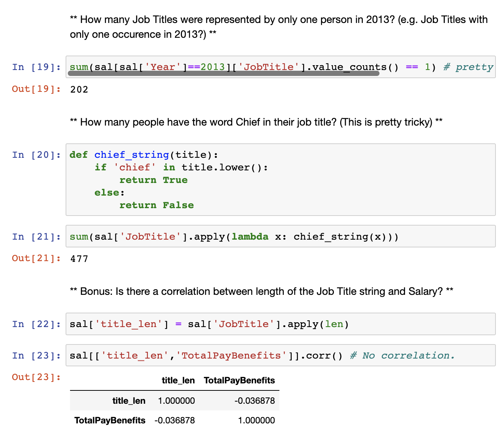
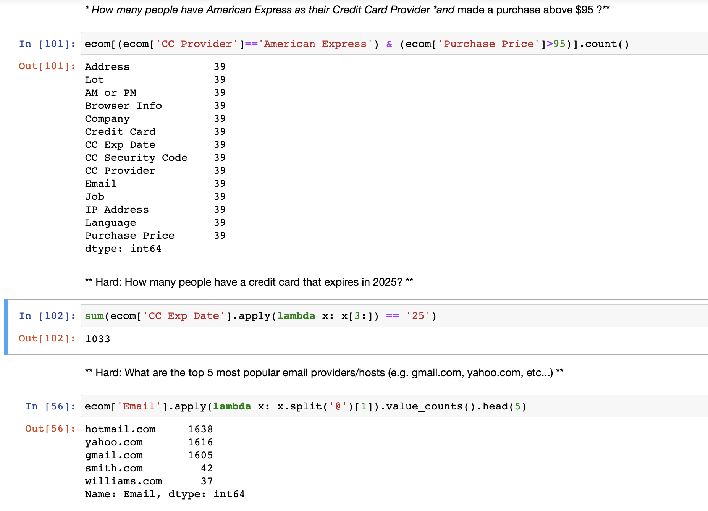

# Python-Pandas-Practice

## Below are the lessons learned in this module:

### Series
A Series is very similar to a NumPy array (in fact it is built on top of the NumPy array object). What differentiates the NumPy array from a Series, is that a Series can have axis labels, meaning it can be indexed by a label, instead of just a number location. It also doesn't need to hold numeric data, it can hold any arbitrary Python Object.

### DataFrames
DataFrames are the workhorse of pandas and are directly inspired by the R programming language. We can think of a DataFrame as a bunch of Series objects put together to share the same index. Let's use pandas to explore this topic!

### GroupBy
The groupby method allows you to group rows of data together and call aggregate functions. You can use the .groupby() method to group rows together based off of a column name. For instance let's group based off of Company. This will create a DataFrameGroupBy object

### Merging,Joining,and Concatenating
There are 3 main ways of combining DataFrames together: Merging, Joining and Concatenating. Concatenation basically glues together DataFrames. Keep in mind that dimensions should match along the axis you are concatenating on. The merge function allows you to merge DataFrames together using a similar logic as merging SQL Tables together. Joining is a convenient method for combining the columns of two potentially differently-indexed DataFrames into a single result DataFrame.

### Operations
There are lots of operations with pandas that will be really useful to you, but don't fall into any distinct category, such as unique values, selecting data, applying functions, finding null values, creating pivot tables, etc.

## Two example solutions are attached to this repository. Below are screenshots of some solutions:

